```{r setup, include=FALSE}
knitr::opts_chunk$set(echo = FALSE)
```

<style>
.column-left3{
  float: left;
  width: 33%;
  text-align: left;
  
}
.column-center3{
  display: inline-block;
  width: 33%;
  text-align: center;
}
.column-right3{
  float: right;
  width: 33%;
  text-align: right;
}
.column-left2{
  float: left;
  width: 50%;
  text-align: left;
}
.column-right2{
  float: right;
  width: 50%;
  text-align: left;
}
</style>

# Hi!

## I'm Daniel

<div class="columns-2">
  
  <br><br><br>

  - Data Engineer, Research Associate
      - [Social and Decision Analytics Laboratory][1]
      - [Biocomplexity Institute at Virginia Tech][2]
  - PhD Student
      - [Genetics, Bioinformatics, and Computational Biology][3]
      - Leveraging government, administrative, and open data sets for public health
  - MPH, Epidemiology, Columbia University
  - Data Scientist, [Lander Analytics][4]
  - Instructor
      - [The Carpentries][7]
        - [Software-Carpentry][8] [Data Carpentry][9]
      - [DataCamp][5]
          - [Cleaning Data in Python][6]
          - Python for useRs
</div>

# Thanks

## Community | Y'all

- #rstatsnyc
- [DataCommunityDC][12]
- [PyData][10]
- [SciPy][11]
- [The Carpentries][7]
    - [Software-Carpentry][8] [Data Carpentry][9]

## Pandas For Everyone
<div class="column-left2">
I'm an Author! :O

<center>

</center>
</div>
<div class="column-right2">
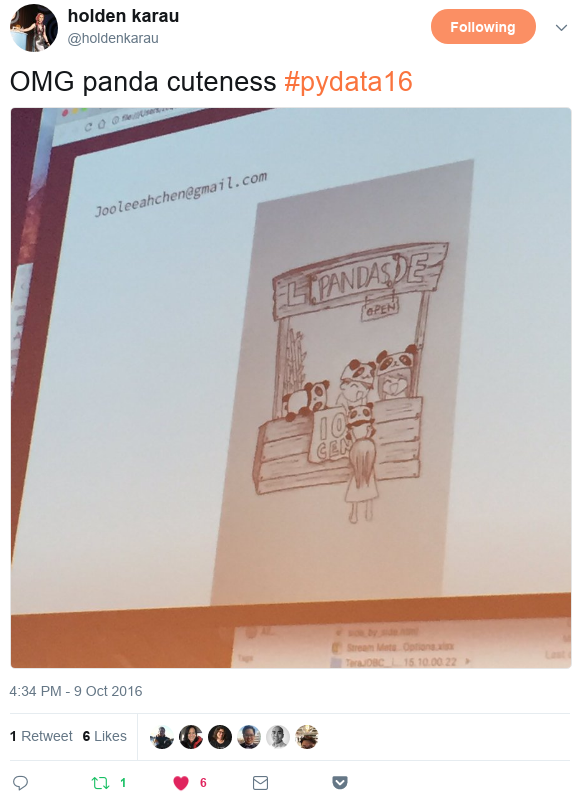
</div>

# Doing Data Science

## R! **and** Python!

<center>

</center>

## We're all friends
<center>
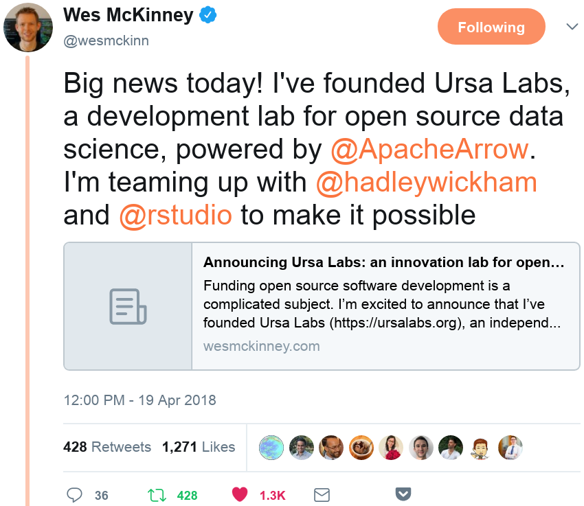
</center>

## What is it? | Tools Used

<center>

</center>

<small>
[Journey to Open Data Science, Anaconda (Continuum Analytics)][13]
</small>

## What is it? | Tasks Performed

<center>

</center>

<small>
[Journey to Open Data Science, Anaconda (Continuum Analytics)][13]
</small>

## Last year...

<center>
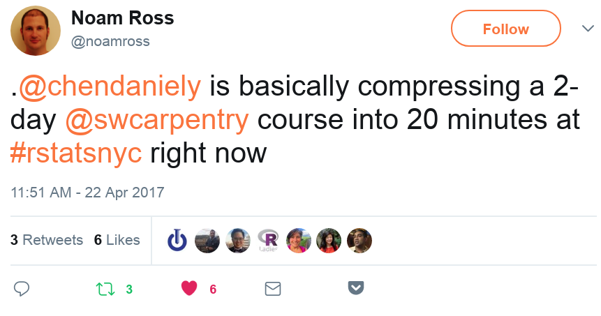
</center>

## Structure your projects!


## (Computational Biology) Project Structure

<center>

</center>

## Script it!

- [Reproducible-Science-Curriculum/rr-init][14]
- [chendaniely/computational-project-cookie-cutter][15]

```bash
cd $1
mkdir doc data src bin results

cd doc
echo "Doc directory with one subdirectory per manuscript" > README
touch .gitkeep

cd ../data
echo "Data directory for storing fixed data sets" > README
touch .gitkeep

cd ../src
echo "src for source code" > README
touch .gitkeep

cd ../bin
echo "bin for compiled binaries or scripts" > README
touch .gitkeep

cd ../results
echo "Results directory for tracking computational experiments peformed on data" > README
touch .gitkeep

echo "Folders created."

cd ..
```

## Best Practices ... (2014)


## Good enough practices ... (2017)


## tl;dr

<div class="column-left2">
Best Practices
<br>
<ol>
  <li> Write programs for people, not computers </li>
  <li> Let the computer do the work </li>
  <li> Make incremental changes </li>
  <li> Don't repeat yourself (or others) </li>
  <li> Plan for mistakes </li>
  <li> Optimize software only after it works correctly </li>
  <li> Document design and purpose, not mechanics </li>
  <li> Collaborate </li>
</ol>
</div>
<div class="column-right2">
Good Enough
<br>
<ol>
  <li> Data management</li>
  <li> Software</li>
  <li> Collaboration</li>
  <li> Project Organization</li>
  <li> Keeping track of changes</li>
  <li> Manuscripts</li>
</ol>
</div>

## <!-- DSPG -->  Summer Program | + ~20 people into the lab ... to stress test!

<center>
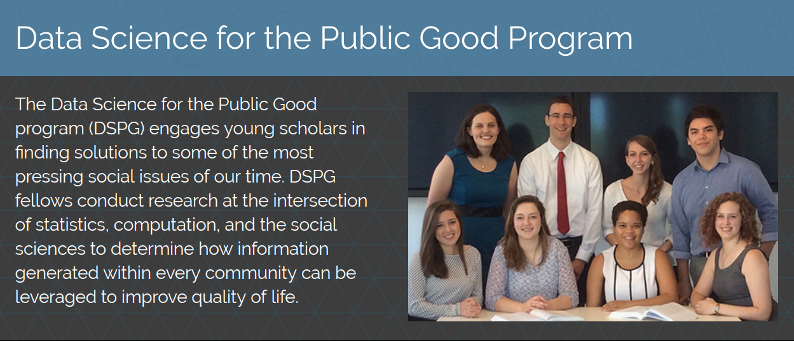
</center>

<small>
https://www.bi.vt.edu/sdal/projects/data-science-for-the-public-good-program
</small>

## <!-- Docker --> 

Blog post: [From VMs to LXC Containers to Docker Containers][16]

<div class="column-left2">
<center>
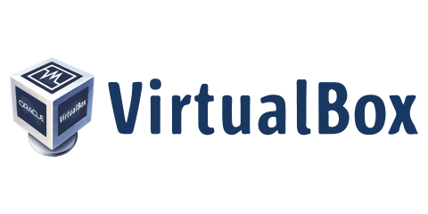
<br>

</center>
</div>
<div class="column-right2">
<ul>
  <li>fully document the setup process</li>
  <li>tear down and spin up the container if something goes wrong</li>
  <li>system libraries for R packages</li>
  <li>easy to try out a new technology before full integration</li>
</ul>
</div>

## <!-- Infrastructure -->  Infrastructure

<center>
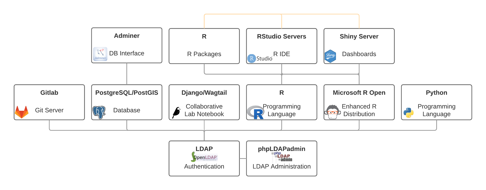
</center>

https://github.com/bi-sdal/dockerimages
<br>
https://github.com/bi-sdal/infrastructure_submodules

## <!-- Project Template -->  Project Template

<center>
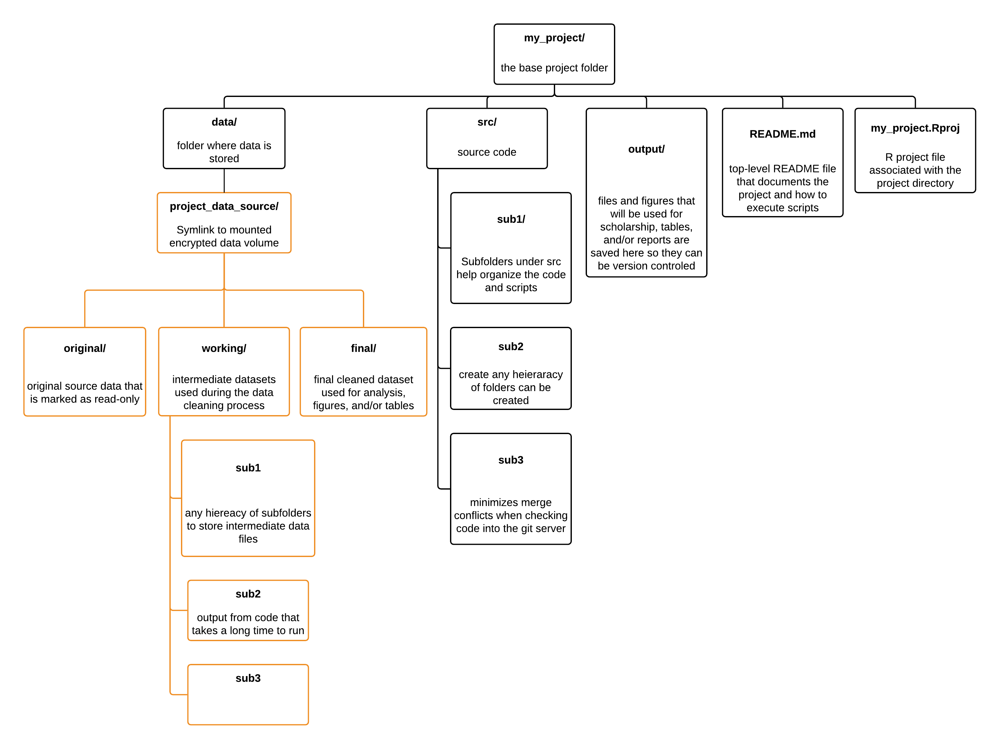
</center>

## Installing R Packages

- Separate Docker Container for installing R packages (`rpkgs`)
- This installs R packages into a persistent docker volume
- Everyone has `/rpkgs` mounted in their `rstudio` container
- Add `/rpkgs` to everyone's `.libPaths()`
```R
site_path = R.home(component = "home")
### <b>
fname = file.path(site_path, "etc", "Rprofile.site")
write(".libPaths(c('/rpkgs', .libPaths()))", file = fname, append = TRUE) # prepend to .libPaths
### </b>
write('local({r <- getOption("repos"); r["CRAN"] <- "https://cloud.r-project.org/"; options(repos=r)})',
      file = fname, append = TRUE)
```

## Installing R Packages (Development Server)

- In `rpkgs`: `install.packages()`

Unless you need system libraries (e.g., CentOS)

https://github.com/bi-sdal/infrastructure_submodules#installing-the-system-library-for-all-docker-images

1. Add the installation in the `mro` `Dockerfile`, e.g., `yum install -y jq-devel && \`
2. Build the base `mro`, `rpkgs`, `rstudio`, and `shiny` images
3. Push the images to dockerhub, `docker push`
```bash
docker push sdal/mro-c7sd_auth
docker push sdal/rss-mro-c7sd_auth
docker push sdal/rpkgs-mro-c7sd_auth
docker push sdal/shy-mro-c7sd_auth
```

## Installing R Packages (Production Server)

1. Pull the images from dockerhub, `docker pull`
```bash
docker pull sdal/mro-c7sd_auth
docker pull sdal/rss-mro-c7sd_auth
docker pull sdal/rpkgs-mro-c7sd_auth
docker pull sdal/shy-mro-c7sd_auth
```

2. Start up the RStudio containers, `docker-compose -f rstudio-compose.yml up -d --no-recreate`

## RStudio Server

- Open Source Edition great for individual use
  - Pretty much building the Pro stack...
  - `nginx`
    - web server: reverse proxy, load balancer,  and HTTP cache
- Exploring RStudio Pro... much better suited for parallel projects, groups, and teams (?)

## RStudio Server for Everyone

`docker-compose.yml`/`rstudio-compose.yml`:
```yaml
volumes:
  rpkgs:

services:
  rstudio_chend:
    image: sdal/rss-mro-c7sd_auth
    container_name: rstudio_chend
    volumes:
      - /sys/fs/cgroup:/sys/fs/cgroup:ro
      - /etc/group:/etc/group
      - /home:/home
      - rpkgs:/rpkgs
      - checkpoint:/checkpoint
    cap_add:
      - SYS_ADMIN
    ports:
      - 3125:8787
```

## Authorship

- Collaborative $\LaTeX$ with real-time rendering... with Git!

<div class="column-left2">


Virginia Tech Libraries provides free Overleaf Pro+ accounts
</div>
<div class="column-right2">

<ul>
  <li>[Try it with Docker!][17]</li>
  <li>[docker-compose.yml][18]</li>
  <ul>
    <li>ShareLaTeX</li>
    <li>MongoDB</li>
    <li>Redis</li>
  </ul>
</ul>
</div>

## Sharing Documenting Projects

<div class="column-left2">

</div>
<div class="column-left2">
<br>
<br>
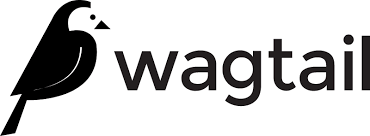
</div>

# The Skills

## Git *is* hard & Shell (Bash) is the glue

<div class="column-left2">
<center>

<br>
Greg Wilson
<br>
Head of Instructor Training @ DataCamp
<br>
Co-founder of Software Carpentry
</center>
</div>
<div class="column-right2">
Free DataCamp Courses:
<ul>
    <li><a href='https://www.datacamp.com/courses/introduction-to-shell-for-data-science'>Introduction to Shell for Data Science</a></li>
    <li><a href='https://www.datacamp.com/courses/introduction-to-git-for-data-science'>Introduction to Git for Data Science</a></li>
</ul>


<a href='https://software-carpentry.org/lessons/'>Software-Carpentry Lessons:</a>

<ul>
    <li>Shell</li>
    <li>Git/Mercurial</li>
    <li>SQL</li>
    <li>Python</li>
    <li>R</li>
    <li>MATLAB</li>
    <li>Make</li>
</ul>
</div>

## Balancing best/good practices... | ... with getting work done

<div class="columns-2">
<center>

<br>
Titus Brown<br>
Associate Professor at UC Davis
</center>
<br><br><br>

**Write Functions!** in your projects

- Software-Carpentry Lessons
    - [Programming with R][20]
    - [R for Reproducible Scientific Analysis][21]
- DataCamp has an *entire* [course][22]
<hr>
- No need to package up functions that you won't be using again
- But when you start to use them in multiple projects...
    - Expand your function to be more general and robust
    - Move it in to a package.

</div>

## No `setwd()`!

- Use rprojects!
    - Open them: `rstudioapi::openProject(...)`
- `here` package, "A simple interface to rprojroot": https://github.com/r-lib/here
    - `print(R.utils::sourceDirectory(here::here('shiny', 'functions')))`
    - No more `if (interactive()){...}`
- `rprojroot`: https://github.com/r-lib/rprojroot

## Saving things

- Save out long calculations into intermediate datasets
- Use `base::saveRDS()` and `base::readRDS()`
    - vs `base::save()` and `base::load()`


```{r, echo=TRUE}
v <- 1:10 # I want to save this...

save(v, file = 'awesome_datascience.RData')
rm(v)
load(file = 'awesome_datascience.RData')
v

saveRDS(v, file = 'super_awesome_datascience.RDS')
loaded <- readRDS(file = 'super_awesome_datascience.RDS')
loaded
```

## Secrets
- Hardcoding secrets (e.g., passwords, API keys) in your code
- Reverting lines before a `commit`
- Sourcing a special ignored file

```r
# uses console or rstudio to do password prompt
getPass::getPass("database username")
```

## Secret Library

```r
.secret_to_keep <- function(user, pass) {
    if (is.null(pass)) {
        ### <b>
        pass <- getPass("LDAP Password (the one you use to login to Lightfoot and RStudio):")
        ### </b>
    }
    secret_to_keep <- c(password = pass,
                        username = user)
    return(secret_to_keep)
}

setup_user_pass <- function(username = unname(Sys.info()['user']),
                            password = NULL,
                            public_key = '~/.ssh/id_rsa.pub',
                            vault = '/home/sdal/projects/sdal/vault',
                            secret_name = unname(Sys.info()['user']),
                            verbose = FALSE) {
    ### <b>
    add_user(username, public_key, vault)
    secret_to_keep <- .secret_to_keep(user = username, pass = password)
    add_secret(secret_name, secret_to_keep, users = username, vault = vault)
    ### </b>
}

get_my_password <- function(secret_name = unname(Sys.info()['user']),
                            key = local_key(),
                            vault = '/home/sdal/projects/sdal/vault') {
    ### <b>
    return(unname(get_secret(secret_name, key , vault)['password']))
    ### </b>
}
```

## Package!

I learned from last year, we should all probably just create packages for ourselves/group/lab/company

`sdalr`, https://github.com/bi-sdal/sdalr/blob/master/R/user_pass.R

<center>

</center>

## Testing

RStatsNYC 2016: Data Testing

- Repo: https://github.com/chendaniely/2016-04-08-rstatsnyc_testing
- Video: https://www.youtube.com/watch?v=CAy0udiWwmg


# Cookbooks

## RMarkdown

- This presentation is written in it!
- 
- I've given Meetup Talks about it: [NYC][26], [DC][27]
- Websites, Books, Presentations, Dashboards, Reports...
    - https://rmarkdown.rstudio.com/

## Graphics Cookbook

- How to do something
- Gallery of plots
- Similar to: http://www.cookbook-r.com/Graphs/

<center>

</center>


## A Better Default Colormap for Matplotlib | SciPy 2015 | Nathaniel Smith and Stéfan van der Walt

- https://www.youtube.com/watch?v=xAoljeRJ3lU
- "Perceptually uniform", sequential, works well in black-and-white, Colorblind friendly
- Matlab: parula

<center>
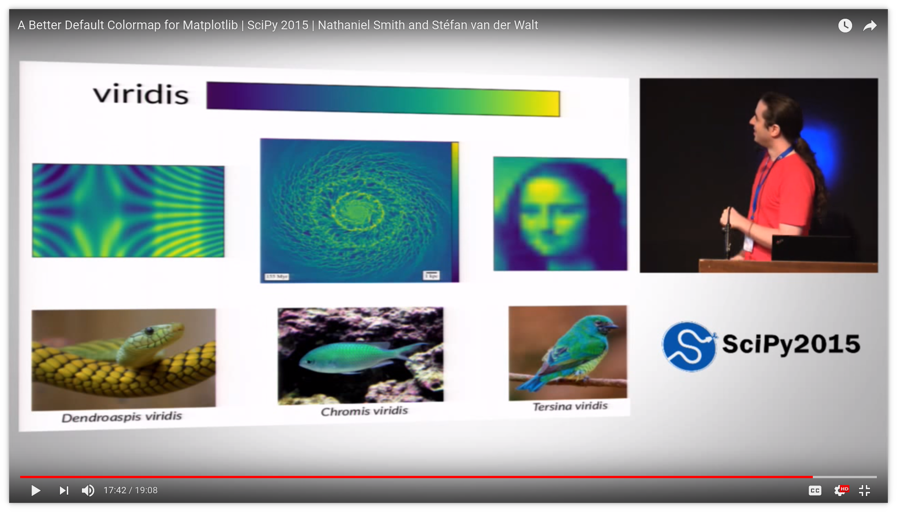
</center>

## Virdis

`viscm`, a tool to see how "good" your colormap is: http://bids.github.io/colormap/

- R Package!
  - https://cran.r-project.org/web/packages/viridis/vignettes/intro-to-viridis.html
  - by: Simon Garnier, **Noam Ross**, Bob Rudis, Marco Sciaini, Cédric Scherer

<center>
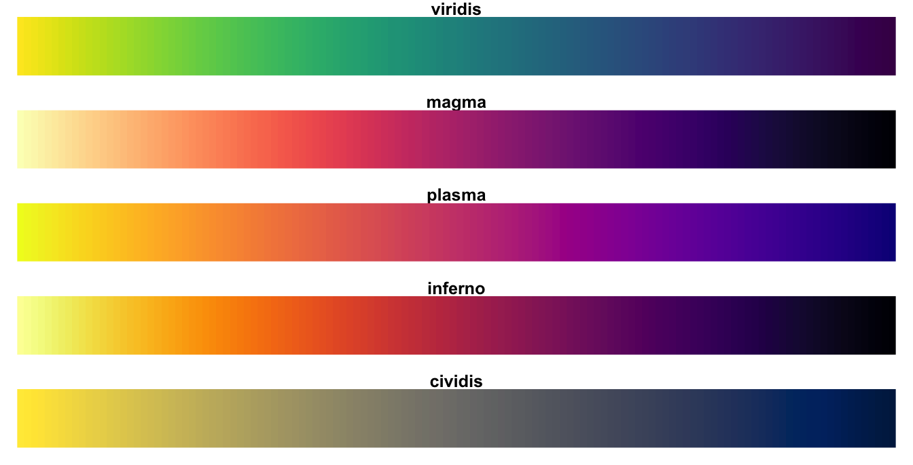
</center>

## Perceptual Color Maps in matplotlib for Oceanography | SciPy 2015 | Kristen Thyng
- Domain specific color maps (Oceanography): https://www.youtube.com/watch?v=XjHzLUnHeM0

<center>
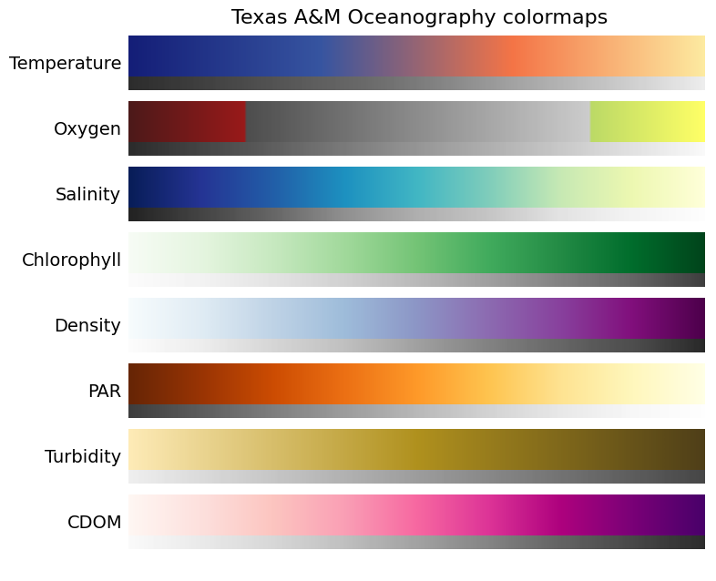
</center>

## Colorbrewer

<center>
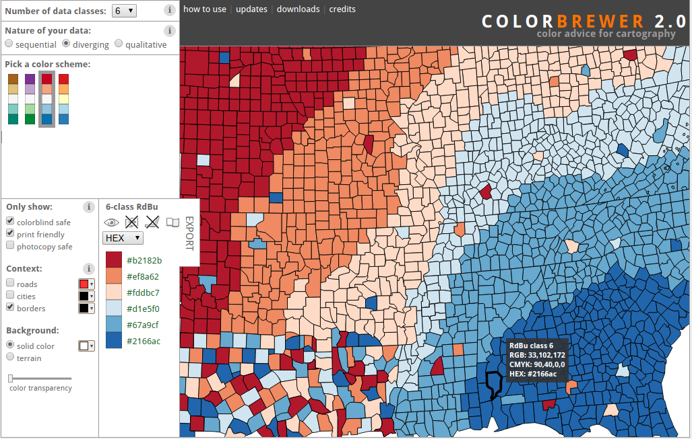
</center>

## Other things

- Cookbooks for you own usecases (e.g., GIS)
- Make your own "flight rules"

>  *Flight Rules* are the hard-earned body of knowledge recorded in manuals that list, step-by-step, what to do if X occurs, and why. Essentially, they are extremely detailed, scenario-specific standard operating procedures. [...]

> NASA has been capturing our missteps, disasters and solutions since the early 1960s, when Mercury-era ground teams first started gathering "lessons learned" into a compendium that now lists thousands of problematic situations [...] and their solutions.

&mdash; Chris Hadfield, *An Astronaut's Guide to Life*.

<center>

</center>

## Why?

> Our planet needs our help, and we need (good) science to fix it.

&mdash; Greg Wilson

# Thanks, again!

## :) #rstatsnyc #nycdatamafia

<div class="column-left2">
<center>
<small>
[#hobbestheblueheelermix][24]<br>
[#rdogladies][25]
</small>
</center>
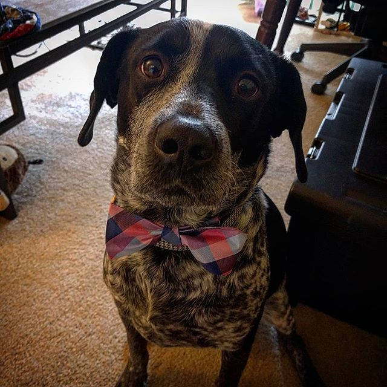
#bowtiesarecool
</div>
<div class="column-left2">
chendaniely:
<ul>
    <li>twitter</li>
    <li>github</li>
    <li>github.io</li>
    <li>instagram</li>
</ul>
Slides:<br />
<a href='>https://github.com/chendaniely/rstatsnyc_2018-data_science'>
<font size="3">
    https://github.com/chendaniely/rstatsnyc_2018-data_science
</font>
</a>
<br><br>
<center>
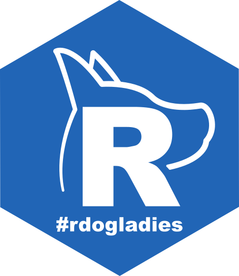
</center>
</div>


[1]: https://www.bi.vt.edu/sdal
[2]: https://www.bi.vt.edu/
[3]: http://gbcb.vbi.vt.edu/
[4]: https://www.landeranalytics.com/
[5]: https://www.datacamp.com/
[6]: https://www.datacamp.com/courses/cleaning-data-in-python
[7]: https://carpentries.org/
[8]: https://software-carpentry.org/
[9]: http://www.datacarpentry.org/
[10]: https://pydata.org/
[11]: https://conference.scipy.org/
[12]: http://www.datacommunitydc.org/meetups-overview/
[13]: https://www.slideshare.net/continuumio/journey-to-open-data-science
[14]: https://github.com/Reproducible-Science-Curriculum/rr-init
[15]: https://github.com/chendaniely/computational-project-cookie-cutter
[16]: http://chendaniely.github.io/sdal/2017/07/07/vm_lxc_docker/
[17]: https://github.com/sharelatex/sharelatex/wiki/Quick-Start-Guide
[18]: https://github.com/sharelatex/sharelatex/blob/master/docker-compose.yml
[19]: https://www.overleaf.com/edu/vtech
[20]: http://swcarpentry.github.io/r-novice-inflammation/02-func-R/
[21]: http://swcarpentry.github.io/r-novice-gapminder/10-functions/
[22]: https://www.datacamp.com/courses/writing-functions-in-r/
[23]: https://software-carpentry.org/lessons/
[24]: https://www.instagram.com/explore/tags/hobbestheblueheelermix/
[25]: https://twitter.com/hashtag/rdogladies
[26]: https://github.com/chendaniely/2017-06-26-meetup-r_you_markDown
[27]: https://github.com/chendaniely/2017-08-15-meetup-r_you_markDown
