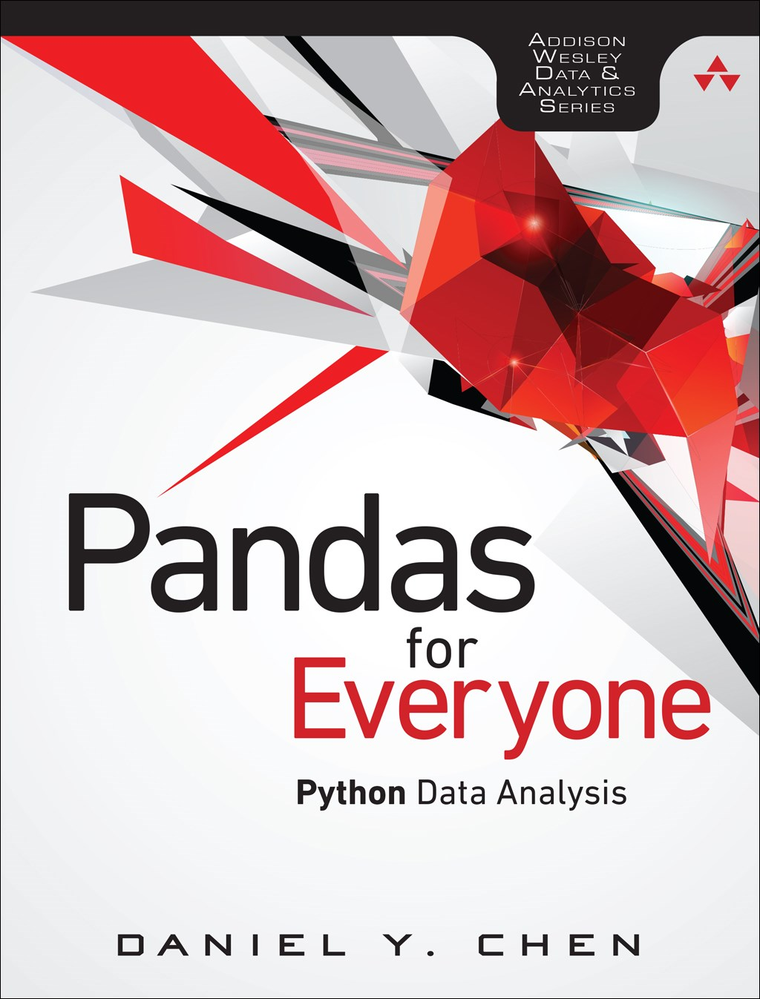
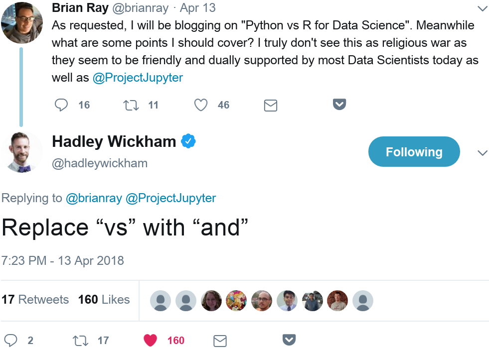
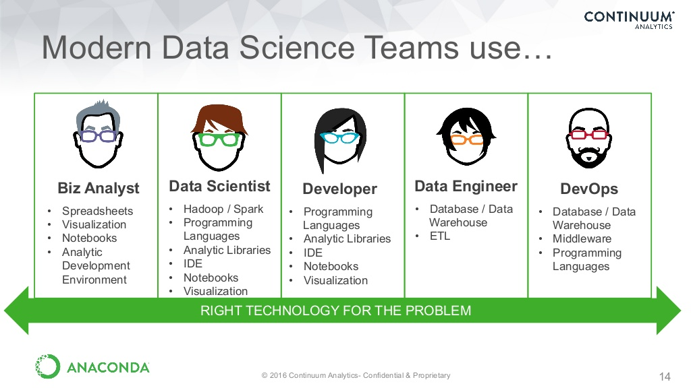
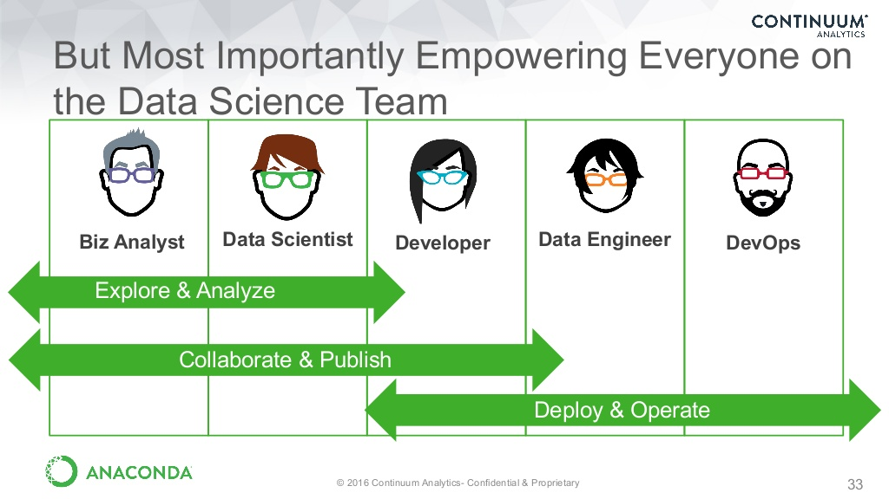
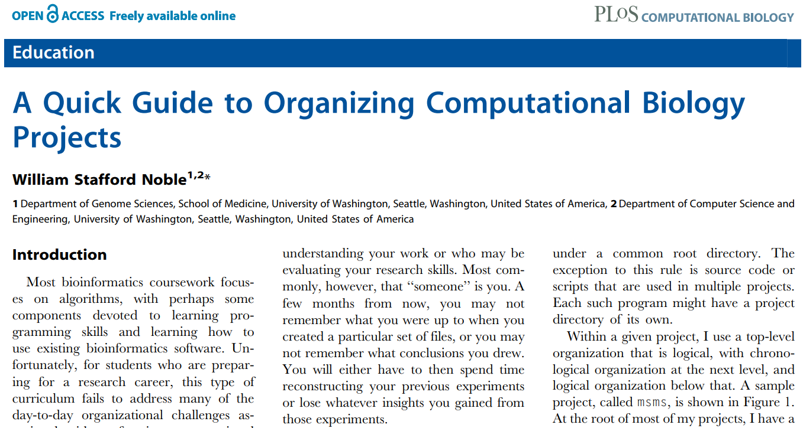
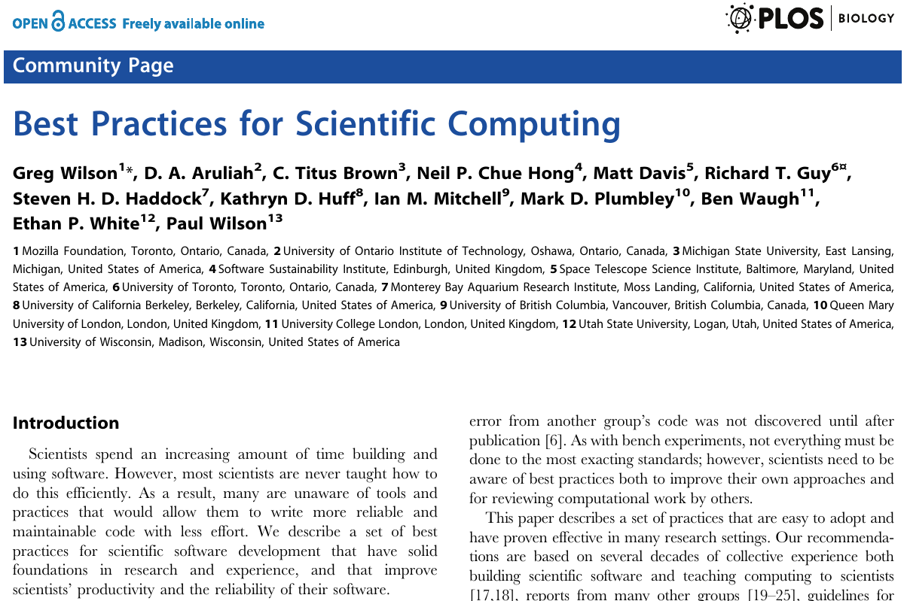
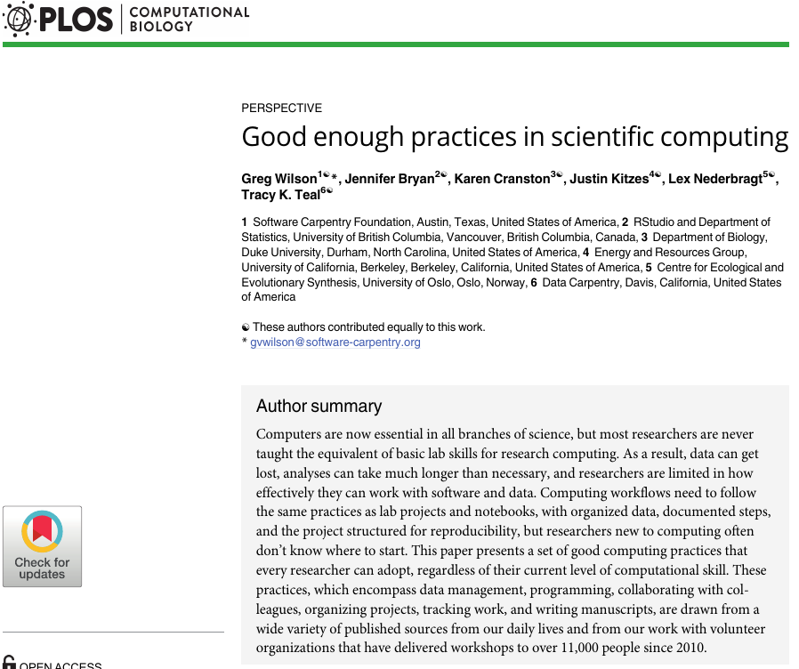

```{r setup, include=FALSE}
knitr::opts_chunk$set(echo = FALSE)
```

<style>
.column-left3{
  float: left;
  width: 33%;
  text-align: left;
}
.column-center3{
  display: inline-block;
  width: 33%;
  text-align: center;
}
.column-right3{
  float: right;
  width: 33%;
  text-align: right;
}
.column-left2{
  float: left;
  width: 50%;
  text-align: left;
}
.column-right2{
  float: right;
  width: 50%;
  text-align: left;
}

# Hi!

## I'm Daniel

<div class="columns-2">
  
  <br>

  - Data Engineer, Research Associate
      - [Social and Decision Analytics Laboratory][1]
      - [Biocomplexity Institute at Virginia Tech][2]
  - PhD Student
      - [Genetics, Bioinformatics, and Computational Biology][3]
      - Leveraging government, administrative, and open data sets for public health
  - Data Scientist
      - [Lander Analytics][4]
  - Instructor
      - [DataCamp][5]
          - [Cleaning Data in Python][6], Python for useRs
      - [The Carpentries][7]
          - [Software-Carpentry][8] [Data Carpentry][9]
</div>

# Thanks

## Community | Y'all

- #rstatsnyc
- [@DataCommunityDC][12]
- [PyData][10]
- [SciPy][11]
- [The Carpentries][7]
          - [Software-Carpentry][8] [Data Carpentry][9]

## Pandas For Everyone
I'm an Author! :O

<center>

</center>

# Doing Data Science

## R! **and** Python!

<center>

</center>

## What is it? | Tools Used

<center>

</center>

<small>
[Journey to Open Data Science, Anaconda (Continuum Analytics)][13]
</small>

## What is it? | Tasks Performed
<center>

</center>

<small>
[Journey to Open Data Science, Anaconda (Continuum Analytics)][13]
</small>

## Last year...



## (Computational Biology) Project Structure

<center>

</center>

## Script it!

- [Reproducible-Science-Curriculum/rr-init][14]
- [chendaniely/computational-project-cookie-cutter][15]

## Best Practices for Scientific Computing



## Good enough practices in scientific computing



## tl;dr

<div class="column-left2">
Best Practices
<br>
<ol>
  <li> Write programs for people, not computers </li>
  <li> Let the computer do the work </li>
  <li> Make incremental changes </li>
  <li> Don't repeat yourself (or others) </li>
  <li> Plan for mistakes </li>
  <li> Optimize software only after it works correctly </li>
  <li> Document design and purpose, not mechanics </li>
  <li> Collaborate </li>
</ol>
</div>
<div class="column-right2">
Good Enough
<br>
<ol>
  <li> Data management</li>
  <li> Software</li>
  <li> Collaboration</li>
  <li> Project Organization</li>
  <li> Keeping track of changes</li>
  <li> Manuscripts</li>
</ol>
</div>
## SDAL's Infrastructure

## Docker

## Software and Code

## Rstudio

community edition great for individual use...
Exploring rstudio pro... much better suited for parallel projects and groups

## Authorship

## Project Template

## R Package

## Balancing good practices

## Saving things

## Secrets

## Opening things

rstudioapi::openProject(newProject)
here
https://github.com/r-lib/rprojroot

# Cookbooks

## Graphics

## 


A Better Default Colormap for Matplotlib | SciPy 2015 | Nathaniel Smith and Stéfan van der Walt
- https://www.youtube.com/watch?v=xAoljeRJ3lU
- "perceptually uniform"
- Sequential
- Works well in black-and-white
- Colorblind friendly
- Matlab: parula

## Virdis

*Dendroaspis* virdis, a snake
*Chromis* virdis, a fish
*Tersina* virdis, a bird

vs parula: more brightness variation

Viscm, a tool to see how "good" your colormap is: http://bids.github.io/colormap/

Perceptual Color Maps in matplotlib for Oceanography | SciPy 2015 | Kristen Thyng
- Domain specific color maps (Oceanography)
- https://www.youtube.com/watch?v=XjHzLUnHeM0

- R Package
https://cran.r-project.org/web/packages/viridis/vignettes/intro-to-viridis.html

Simon Garnier, **Noam Ross**, Bob Rudis, Marco Sciaini, Cédric Scherer

## Themes

## Other things (GIS)

## Make your own "flight rules"

## RMarkdown

link to markdown talk(s)

mention the 'fix' to knitting documents

## Testing

Link to talk 2 years ago

Show how to 'test' outside a package


[1]: https://www.bi.vt.edu/sdal
[2]: https://www.bi.vt.edu/
[3]: http://gbcb.vbi.vt.edu/
[4]: https://www.landeranalytics.com/
[5]: https://www.datacamp.com/
[6]: https://www.datacamp.com/courses/cleaning-data-in-python
[7]: https://carpentries.org/
[8]: https://software-carpentry.org/
[9]: http://www.datacarpentry.org/
[10]: https://pydata.org/
[11]: https://conference.scipy.org/
[12]: http://www.datacommunitydc.org/meetups-overview/
[13]: https://www.slideshare.net/continuumio/journey-to-open-data-science
[14]: https://github.com/Reproducible-Science-Curriculum/rr-init
[15]: https://github.com/chendaniely/computational-project-cookie-cutter
